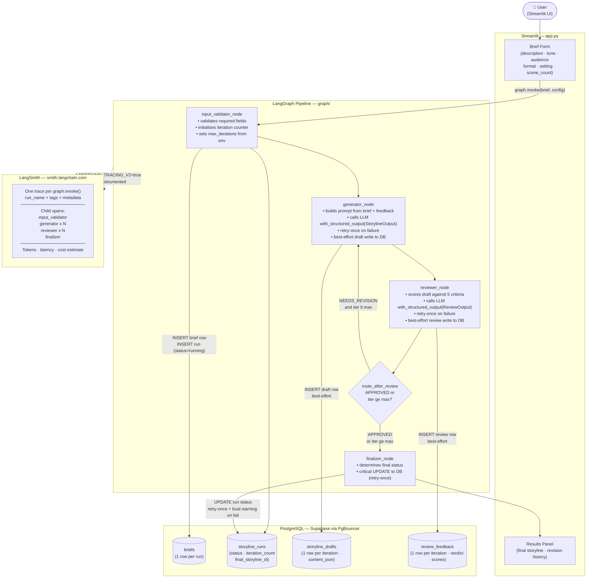

# CharacterForge — System Architecture

## Key Design Decisions

| Decision | Rationale |
|---|---|
| Single `BriefState` TypedDict | One object flows through all nodes; no hidden inter-node contracts |
| Incremental DB writes | Each draft/review committed immediately — partial failures leave a usable record |
| Two-tier DB write policy | Intermediate writes best-effort (`_db_write`); finalizer UPDATE retries once (`_db_write_critical`) |
| LangGraph conditional edge | Loop logic expressed as a pure routing function — no state mutation in the edge |
| `with_structured_output()` for both agents | Enforces schema at the model layer; no `json.loads()` fragility in application code |
| `run_name` in every `graph.invoke()` | Ensures all LangSmith traces are named, not anonymous `LangGraph` runs |
